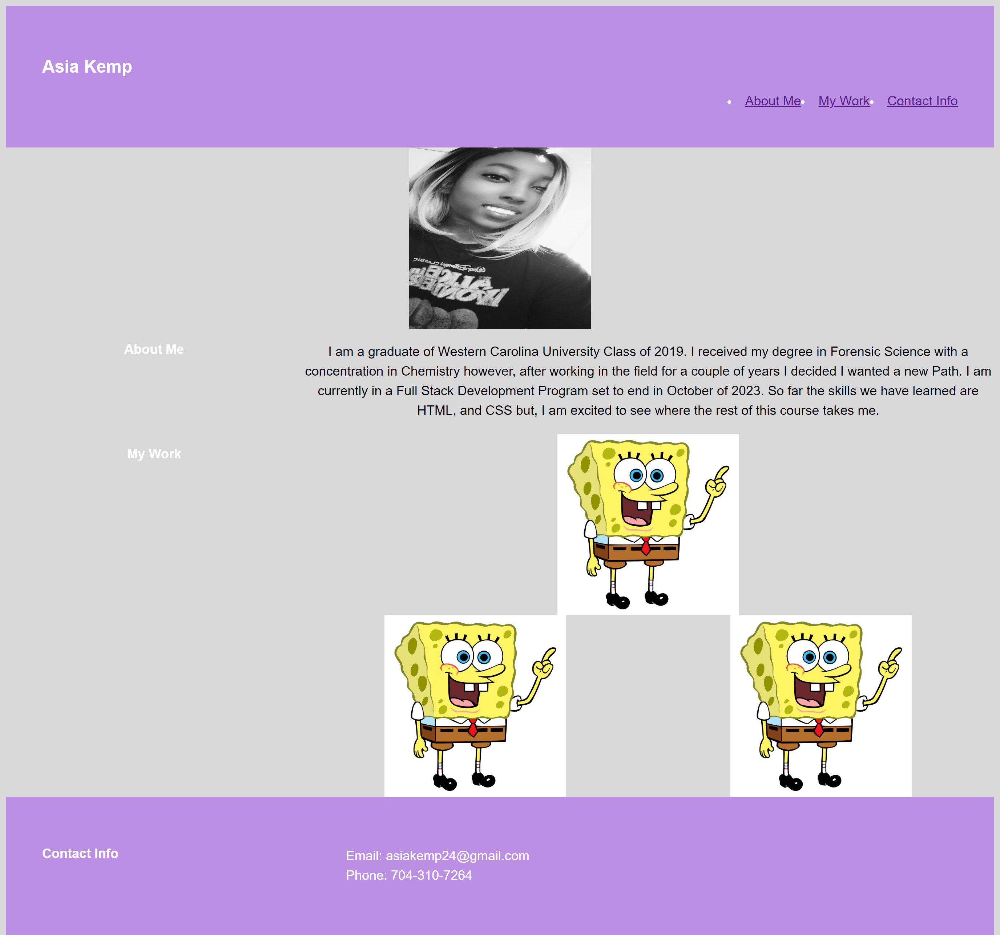

# Asia Kemp Portfolio

## Description

This is the start of a professional portfolio. This is so that I can update the website with projects when I have completed more. THis will help stay organized and keep 
what projects I have been able to complete in one spot that will be able to link to those projects. While completing this website, I have learned more about the importance of 
CSS and all the things it can do (mainly flex properties). This was also the first time that I have created a website completly from scratch. 

## Usage

To see the website use the following link: https://akemp24.github.io/Portfolio/

Right click on the website and go to the inspect button so that you can see the code available.

The website should look the same as below:

